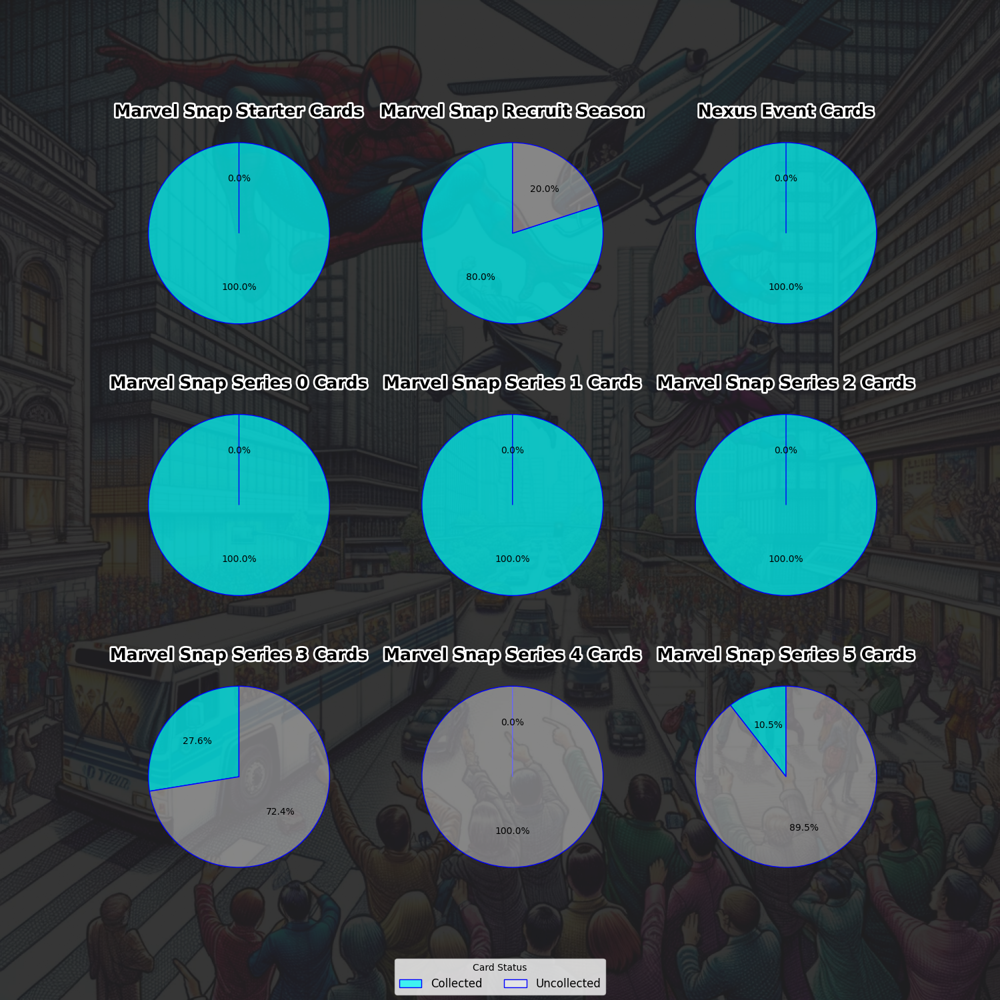
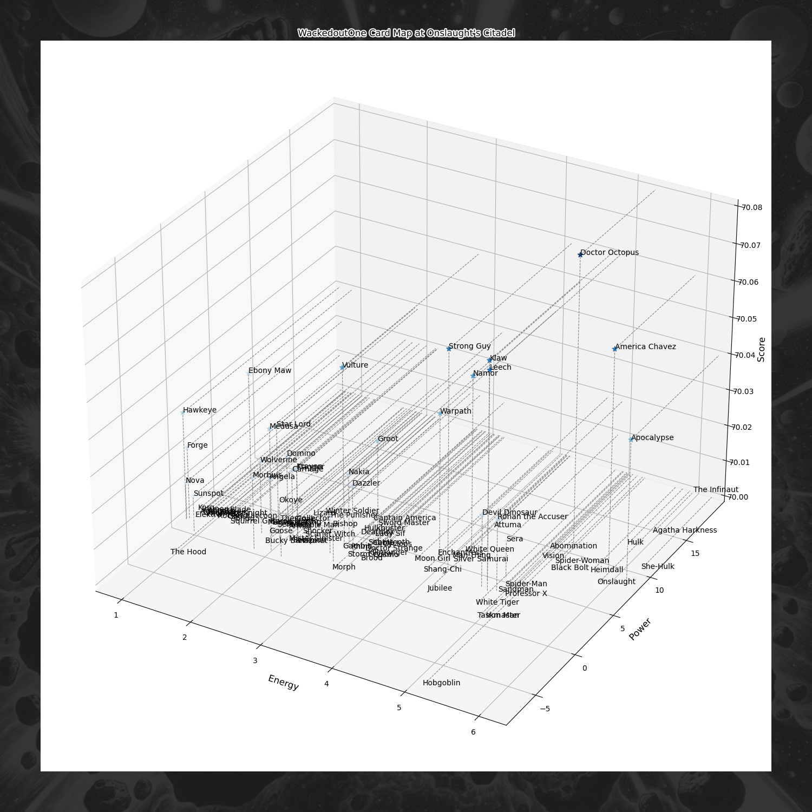

# Snap Calculator

## Introduction

Snap Calculator is a comprehensive tool designed to manage, analyze, and visualize card collections. Serving as a central hub, it integrates various functionalities such as:

- **Graphical Analysis:** Generate pie charts and graphs to visualize your collection.
- **Scoring System:** Evaluate the value and rarity of cards in your collection.
- **Top Cards Management:** Easily identify and manage the top cards in your collection.
- **Building Decks:** Automatically build decks for all locations, or just certain ones.
- **Player Menu:** Personalize settings and preferences for an individualized experience.

Whether you're a casual collector or a seasoned aficionado, Snap Calculator aims to simplify and enhance your card collecting journey.

## Features

Snap Calculator offers a variety of features to manage and analyze your card collection:

## Core Functionalities

### Create Decks Automatically
- **Create Decks from you Collection:** Generate a deck for certain locations, or all locations, using you Collected cards.

### Get Scoring Values
- **Get Location-Card Overall Score:** Calculate an overall compatibility score between a given location and card.
- **Get Location-Card Linking Score:** Compute a score based on how well a card and location are linked.

### Create Analysis Files
- **Analyze Location Patterns:** Perform analysis on location patterns and save the results.
- **Analyze Cards Patterns:** Analyze card patterns and save the results.
- **Analyze Location-Card Links:** Analyze the links between locations and cards.

### Create Data Graphs
- **Create Total vs Collected Cards Pie Chart:** Generate a pie chart showing the total vs collected cards.

- **Create Uncollected Cards by Series Pie Charts:** Generate pie charts depicting uncollected cards by series.

- **Create Card-Location Compatibility Wavemap:** Generate a heatmap showing the compatibility between cards and locations.

### Player Details Setup
- **Player List:** Manage and navigate through a list of players.
- **Add New Player:** Add new players to the list.
- **Delete Player:** Remove players from the list.
- **Edit Collection:** Navigate to the collection submenu to edit the player's collection.
- **Edit Decks:** Navigate to the deck submenu to edit the player's decks.
- **Player Decks:** Manage and navigate through a list of decks owned by the player.
- **Add New Decks:** Add new decks to the player's collection.
- **Delete Decks:** Remove decks from the player's collection.

## Matrix Setup

### Overview
The scoring system in Snap Calculator relies on a series of matrices and computation logic to evaluate the compatibility and effects between cards and locations. Each matrix file under `modules/matrix` contains predefined rules or score values for different gameplay mechanics. These matrices are then utilized in the `snap_base.py` file, where the actual computation takes place, to generate scores for different card and location combinations.

### How to Edit Matrix Files

#### card_matrix.py
- This file defines the effects and patterns for gameplay mechanics related to cards. 
- To update or add a new rule, add a dictionary entry specifying the `Effect`, `Pattern`, and `Score`.

#### link_matrix.py
- This file defines the linking rules between location and card contexts.
- To modify the linking rules, update the dictionary entries for `LocationContextID` and `CardContextID`.

#### location_matrix.py
- This file defines the effects and patterns for gameplay mechanics related to locations.
- Similar to `card_matrix.py`, you can add or modify dictionary entries for `Effect`, `Pattern`, and `Score`.

## Installation
- Install the dependencies by running `pip install -r requirements.txt`.

## Usage
- Run the project by executing `python snap.py`.

## Directories and Files
- **requirements.txt**: This is a text file that may contain important notes or configuration details.
- **snap.py**: This is a Python script that contains code for the project.
- **assets**: This is a directory that likely contains related files or modules.
- **modules**: This is a directory that likely contains related files or modules.
- **player**: This is a directory that likely contains related files or modules.
- **results**: This is a directory that likely contains related files or modules.
- **system**: This is a directory that likely contains related files or modules.
- **Tools**: This is a directory that likely contains related files or modules.
- **.gitignore**: This is a file of unknown type.
- **missing.txt**: This is a text file that may contain important notes or configuration details.

## Contributing
- You can contribute by joining our developers for this porject.
- You can also Venmo me donations to @BradfordBrooks79

## License
Copyright 2023 Bard Brooks

Licensed under the Apache License, Version 2.0 (the "License");
you may not use this file except in compliance with the License.
You may obtain a copy of the License at

    http://www.apache.org/licenses/LICENSE-2.0

Unless required by applicable law or agreed to in writing, software
distributed under the License is distributed on an "AS IS" BASIS,
WITHOUT WARRANTIES OR CONDITIONS OF ANY KIND, either express or implied.
See the License for the specific language governing permissions and
limitations under the License.
